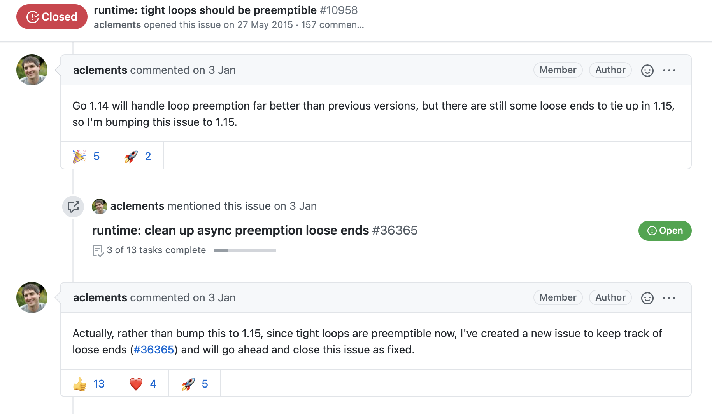

## case

**runtime:搶佔式調度問題**

下面這段代碼為什麼會卡死？

```go
package main

import (
    "fmt"
    "runtime"
)

func main() {
    var i byte
    go func() {
        for i = 0; i <= 255; i++ {
        }
    }()
    fmt.Println("Dropping mic")
    // Yield execution to force executing other goroutines
    runtime.Gosched()
    runtime.GC()
    fmt.Println("Done")
}
```

## solution

1. byte 是 uint8 的別名，取值爲 0～255。因此 i≤255 永遠成立。該循環是一個死循環。
2. `runtime.Gosched()` 會讓出 CPU 執行時間給其他 Go 程，然後繼續執行。
3. 在不支持搶佔式調度(preemptive)的 Go 版本下，該代碼會在 runtime.GC 處卡死，因爲 GC 會等待所有 Go 程執行完畢或者**進行函數調用的時候**進行。顯然題中有一個 Go 程沒有進行函數調用且無限循環。可以通過 `GODEBUG=asyncpreemptoff=1 <編譯後的程序>` 模擬。

附：Go 1.14 已經基本解決循環搶佔式問題，收尾工作在 Go1.15 也已經完成。

[https://github.com/golang/go/issues/10958](https://github.com/golang/go/issues/10958)

